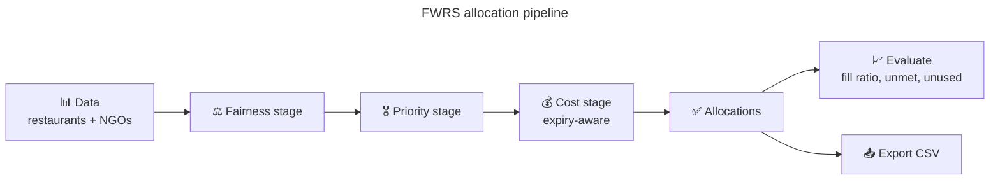

# 🥗 FWRS — Food Waste Reduction System

An optimization platform that allocates surplus food from restaurants to NGOs using
**linear programming** — a 3-stage lexicographic solver (fairness → priority → cost) —
minimizing waste while maximizing social impact.


- **License:** GPL-3.0-or-later
- **Owner:** Gagan Jain ([@gaganjainse](https://github.com/gaganjainse))
- **Stack:** Python 3.12 · PuLP (CBC) · Flask · Folium


## Quick start

```bash
pip install -r requirements.txt

# CLI
python main.py --export allocations.csv --export-summary summary.csv

# Web dashboard (Flask)
python -m flask --app ui.web.app run

# Desktop GUI (Tkinter)
python ui/desktop_app.py
```

## Optimization pipeline

| Stage | Objective | Description |
|---|---|---|
| 1. **Fairness** | max-min fill ratio | maximize the minimum fraction of demand met across NGOs |
| 2. **Priority** | tiered allocation | higher-priority NGOs filled first, tier by tier |
| 3. **Cost** | minimize cost | distance-based cost with **expiry-aware penalty** (travel time vs shelf life) |

The `alpha` parameter weighs priority in the cost stage (0 = pure distance).

## Features

- **3-stage lexicographic LP** — fairness → priority → cost (PuLP/CBC)
- **Expiry-aware routing** — penalizes allocations where travel time exceeds food shelf life
- **Priority-weighted distribution** — NGOs ranked 1–5; configurable via `alpha`
- **Interactive map** — Folium/Leaflet with animated routes, heatmap, priority-colored markers
- **Desktop GUI** — Tkinter dark-mode app with matplotlib charts and bipartite allocation graph
- **Web dashboard** — Flask app to run the LP and download results as CSV
- **CSV export** — allocations and summary metrics

## Architecture

```text
app/                Core logic: models, data loader, distance, LP optimizer, evaluator, exporter
ui/                 Interfaces: desktop (Tkinter), web (Flask), map generator (Folium)
data/               Default dataset (restaurants.csv, ngos.csv — committed, used by tests + demo)
tests/              18 tests — pipeline end-to-end, expiry routing, haversine, loading, metrics, export
main.py             CLI entry point
run_all.py          Interactive launcher menu
```



> Note: the large Bangalore demo dataset and generated map/CSV outputs are **not
> committed** (they're reproducible via `main.py` / `ui/map_generator.py` and
> gitignored). The committed `data/` set is small and deterministic for tests.

## Development

```bash
pytest -q                     # 18 tests
ruff check app/ ui/ tests/    # lint
```


> **Reproducible install:** `requirements.lock` pins every dependency with
> SHA-256 hashes (generated by `pip-compile --generate-hashes`). Install with
> `pip install --require-hashes -r requirements.lock` for a verified, locked build.

## License

GPL-3.0-or-later — see [LICENSE](LICENSE).

## Status

CI green. Security: [SECURITY.md](SECURITY.md). Compiled reading:
[shesh-docs](https://github.com/gaganjainse/shesh-docs).
